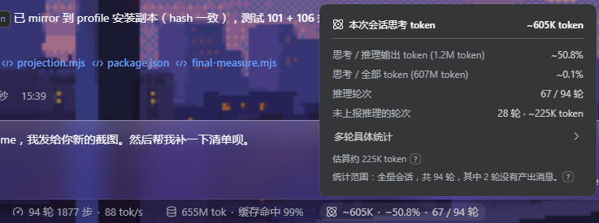
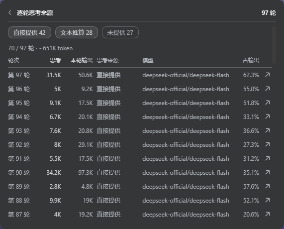

# dsh-thinking-token-stat

> [English](./README.md) | **中文**

[](https://github.com/awesome-dsh-plugin/awesome-dsh-plugin)
[](https://github.com/deepseek-ai/deepseek-harness)
[](./LICENSE)
[](https://www.npmjs.com/package/dsh-thinking-token-stat)
[](https://www.npmjs.com/package/dsh-thinking-token-stat)
[](https://github.com/Six6stRINgs/dsh-thinking-token-stat)
[](https://github.com/Six6stRINgs/dsh-thinking-token-stat/)

在输入框下方的统计行里，一眼看到整场对话的思考 token 总量。点开还能看到它占推理输出的
比例、有多少轮真正思考过，以及其中多少是推算而非上报的。再点进去，可以逐轮看，并看到每一轮
跑的是哪个模型。



输入框下方那一行读数，以及点开后的一级界面：整场思考总量、两个比例、多少轮真正思考过、
其中多少是推算而非上报，以及这些数字实际覆盖的范围。



二级界面：逐轮表格。每一轮一行，包含该轮思考、本轮输出、数字来源、该轮跑的模型，
以及它占本轮输出的比例。

## 你会看到什么

在输入框下方那一行统计里，多出一个读数：

```
💭 37.2K · 70.7% · 4 / 6 轮
```

- **整场对话的思考 token 总量**；
- **它占推理输出的比例**，也就是模型在思考状态下写出的内容里，思考占了多少；
- **有多少轮真的思考过**。这一项只在会话里存在"没思考的轮次"时才出现，
  所以全程使用同一个推理模型时，这一行依然简短清爽。

点一下可以看明细。

## 为什么不再有"每条回复"的读数

DSH 官方每条回复自带的用量面板里，已经有那一轮的推理 token 数，而且那个面板给出的该轮信息
更多。本插件早先版本在每条回复旁显示的数字，实际上只是把点开面板就能看到的东西又重复了
一遍，**因此被移除了。**

官方显示不出来的，是模型根本没有上报的数字。与其在每条回复旁放一个推测值，不如把它放在
会话明细里单独一行，并写明哪一部分是推算出来的。

## 明细里有什么

```
本次会话思考 token                            37.2K token
──────────────────────────────────────────────────────────
思考 / 推理输出 token (52.6K token)              70.7%
思考 / 全部 token (12.4M token)                   0.3%
推理轮次                                      4 / 6 轮
未上报推理的轮次                 2 轮 · ~5.1K token
                              估算约 5.1K token ?
统计范围：全量会话，共 6 轮，其中 1 轮没有产出消息。 ?
```

| 行                 | 含义                                                 |
| ------------------ | ---------------------------------------------------- |
| 思考 / 推理输出    | 模型在思考状态下写出的内容里，思考占多少             |
| 思考 / 全部 token  | 同一比例，换成这些轮次被计费的 token 总量作分母      |
| 推理轮次           | 多少轮思考过 / 一共多少轮                            |
| 未上报推理的轮次   | 有多少轮只能用推算值代替上报值，以及这些推算值占总量多少 |
| 估算约 …           | 同一笔推算值再用文字说明一次，旁边的 `?` 解释推算依据  |
| 统计范围           | 这些数字**实际**覆盖了什么（按折叠结果算，不是写死的）：总轮数、没有产出消息的轮次、fork 被排除的继承历史、以及逐轮明细自身的上限；只要其中任何一项成立，就会带一个 `?` 说明原因 |

百分比保留一位小数；数字较大时会简写，例如 `24.8K`。

**靠推算得来的数字前面会加 `~`**（`~37.2K`、`~70.7%`），输入框那一行和明细里都一样。估算值
旁边的 `?` 会弹出一条简短说明，讲清楚为什么会有估算值；和明细本身一样，点别处它就消失。

明细最下面有一行，可以进入逐轮视图。

## 逐轮明细

逐轮视图每一轮一行，最新的一轮排在最前面：

| 列       | 含义                                             |
| -------- | ------------------------------------------------ |
| 轮次     | 这是第几轮                                       |
| 思考     | 这一轮的思考 token；若是推算值，会带 `~` 并用蓝色标出 |
| 本轮输出 | 这一轮一共写了多少，也就是最后一列的分母           |
| 思考来源 | 这个数字是怎么来的：提供方直接上报、按思考文本推算，或两者都有 |
| 模型     | 这一轮跑的是哪个模型                             |
| 占输出   | 这一轮的思考占它自己输出的多少（带 `~` 表示是推算值） |

表格上方有三个开关，决定列出哪些轮次：直接上报的、按文本推算的、以及完全没有思考数字的。
最后一类默认关闭——没思考过的轮次逐条列出来没有意义，开关上会写明被隐藏了多少条。

**对话开始过的每一轮都会列出，包括失败的那些。** 报错或被中断的轮次不会产生回复，因此没有
token 可统计；但它仍然会出现，每一列都是 `—`、来源是「未提供」——静默跳过它会让表格看起来
像少了一轮，而实际上那一轮什么也没产出。「未提供」开关上的数字里就包含这些轮次，总览的
统计范围那一行也会写明有几轮是这样，并用 `?` 说明它们"没有产出消息"而不是"没有思考"。

**每次只渲染一页 100 轮。** 长对话会变成一张很长的表，为了看十条而铺开一千行是没人要的开销，
所以页面里只存在当前这一页：用 `更新的 / 更早的` 和 `第 2 / 5 页` 翻页。

每一行末尾有一个跳转按钮，可以跳到对话里那一轮的回复。如果那一轮已经不在对话视图里了，
按钮不会有任何反应。

**明细可以从任何地方关掉。** 点输入框区域的其它控件、点界面以外的任何位置，一级和二级面板
都会消失，按 `Esc` 也一样——和 DSH 官方那套统计面板的行为一致。

### 数字是从哪里来的

这个插件由两半组成。**宿主半边**把会话事件日志逐轮折叠一次，并把结果注册成一个 DSH **会话投影**
——和官方统计用的是同一套机制；**浏览器半边**只读这一个值，然后把它画出来。

这就是全部设计，也是这些数字可信的原因：

- **折叠覆盖整条日志，而不是窗口。** DSH 把对话保存成"最近的一段窗口"，压缩还会重写这个窗口，
  所以任何"按屏幕上有什么来算"的数字都是局部且易变的。投影是从每一条已提交事件折出来的，
  随会话一起做检查点，冷读时只补折水位之后的事件——于是这些数字天然是整场的，多长的对话都一样，
  刷新后也完全一致。
- **永远不加载任何东西。** 插件不会把消息读回对话，也不会要求 DSH 这么做。没有"加载更多"，
  因为根本没有东西要加载：宿主早就折完了。
- **浏览器里什么都不缓存。** 没有 localStorage、没有账本、没有按会话的浏览器状态。持久化就是
  投影自己的检查点，它属于会话，而不属于这个插件。
- **每条与助手结算无关的事件都是零开销**，折叠本身每轮只保留六个数字加一份模型名字典。在一场
  真实的 88 轮会话上，它用约 5 毫秒折完 8 988 条事件，落盘 3 KB。

如果宿主提供不了这个投影——旧版 DSH，或者会话还没折过——读数会退回到官方的整场 token 投影，
并在界面上写明，而不是凭空编造逐轮数字。

#### 它占多少存储

折叠的检查点是 DSH 自己那套投影缓存里的一行
（`<root>/session_projcache/sessions/<sessionId>.json`），和官方那些单元放在一起。一行就是每轮
六个数字加一份共享的模型名字典，所以大小只取决于轮数：

| 轮数 | 落盘状态 | 发给浏览器的视图 |
| --- | --- | --- |
| 88（实测的一场真实会话） | 3.0 KB | 2.4 KB |
| 1 000 | ≈ 35 KB | 只发最新 200 行 |
| 5 000（状态自身的上限） | ≈ 175 KB | 只发最新 200 行 |

作为对比：DSH 自己的 `turnOutline` 单元为同一场会话保存的逐轮记录比这更大，`contextBreakdown`
的状态是 54 KB。发布给客户端的视图刻意做了上限：client-visible 的投影值会跟着每一帧快照发送，
所以逐轮行只保留最新 200 行，而合计始终是整场的；超出时总览里会有一行说明。

### 模型列的数据来自哪里

每条结算的助手消息都自带产出它的 provider 与 model，折叠时就把这个名字记在所属的那一轮上——
只在字典里存一次，而不是每行重复。某一轮如果重试后换了模型，两个名字都会列出。这不需要
DSH 的 Trajectory 视图，也不会为它多建一份折叠。

## 数字是怎么来的

能不能读到一个数字，取决于模型提供方：有的会上报推理 token 数，有的只把思考文本发过来，
还有的两者都不提供。

| 提供方给了什么 | 你会看到什么                         |
| -------------- | ------------------------------------ |
| 推理 token 数  | 直接采用，精确                       |
| 只有思考文本   | 按文字长度推算出来的数字             |
| 两者都没有     | 什么都不显示——这条回复计为没有思考 |

**为什么有些数字必须靠推算。** 并非所有提供方都会上报推理 token 数，DSH 也无法强制。
但如果一遇到没有数字就把思考文本也丢掉，就有一整类模型会显示成"完全没思考过"——可思考内容
明明就在屏幕上。所以这里改为量文字长度，而且**按语种取不同密度**——用一条英文规则去量别的
语种，会低估两到四倍：

| 文字类型 | 每 token 字符数 | 依据 |
| --- | --- | --- |
| 中日韩文字、日文假名、韩文谚文、全角形式 | 1 | 这类文字实测约 0.6–1.7 token/字符（取决于分词器），而 DeepSeek 与 Qwen 自家的分词器处于最密的一端（约 0.6–0.8） |
| 西里尔、希腊、阿拉伯、希伯来、亚美尼亚、印度诸文字、泰文、格鲁吉亚文 | 2.5 | 比 CJK 常见但仍不如英文；实测大致在 2–3 字符/token |
| 拉丁字母、数字、标点、空白 | 4 | 英文的常用经验值 |

密集一端取 1 而不是 0.7 是有意的：对中文优化的模型来说这会**略微偏高**，而"偏高一点"比
"看起来像实测、实际上偏低"要好。

这是**推算**而不是测量，我们也是按推算来对待的：靠它得出的每个数字都带 `~`，明细里写明有多少轮
需要推算、这些推算值占总量多少，旁边那个 `?` 点开就是这套规则本身。

**这套区分要花多少代价。** 每个思考文本块两次 `replace`，折叠依然是插件里最快的一环：实测在
本会话 230 万字符的思考文本上，按语种折算只比"一刀切"多花 1.7 毫秒，而整个折叠是 5 毫秒——
约合每次结算 5 微秒，由宿主一次性付出、直接进入持久投影，完全不在渲染路径上。

所有比例只统计**真正思考过的那些轮次**。这是有意的：当你中途切换到不思考的模型，已经显示的
数字不会因为对话变长而开始下滑。同时，"4 / 6 轮"也直接告诉你这个数字覆盖了整场对话的多少。

## 这个插件做什么、不做什么

**做**：把一场对话里的思考量汇总起来，并说明这个数字是怎么得出来的。

**不做**：

- 不修改对话、不干预模型，也不向任何地方发送内容；它在宿主侧读会话自己的事件日志、以及 DSH
  提供的投影，不发起网络请求；
- 模型没有思考、或没有把思考暴露出来时，它不显示任何东西；
- 不假装精确。提供方上报的数字是精确的；由思考文本推算出来的不是精确值，明细里会标明
  它是推算出来的；
- 不统计"窗口"而统计会话本身。这些数字属于整场会话，所以分页和压缩都改不动它们；
- 既不会在你背后读历史，也不会当着你的面加载历史。宿主折的是它本来就有的日志，浏览器半边
  从不读取、也不请求任何一条消息；
- 不往你的浏览器里写任何东西：没有 local storage，也没有插件自己的状态。

## 轻量

- **只多一个小数字。** 单条回复旁边不增加任何东西。
- **宿主只折一次。** 一个只认一种事件类型的 reducer，每轮六个数字；实测每事件 0.6 微秒，其余
  事件只做一次引用比较就返回。
- **不加载、不分页、不缓存。** 浏览器半边只读一个投影值：不持有会话绑定、不打开对话、不存任何东西。
- **只读。** 不增加后台服务，不增加额外请求，也没有网络访问。
- **无需配置。** 没有设置项、不需要账号、不收集数据。
- **空闲时不存在。** 没有思考的对话完全不显示。
- **有上限。** 状态保留 5000 行（≈175 KB），发布给浏览器的视图保留 200 行，表格一次只渲染
  一页 100 轮。
- **自动跟随深浅色主题。**
- **自动跟随界面语言。** 插件只写了 DSH 自带的两种语言（中文与英文），并按 `<html lang>`
  切换；其它情况（包括语言包提供的第三语种）一律显示英文。

## 安装

从 GitHub 安装：

```sh
dsh plugin add github:Six6stRINgs/dsh-thinking-token-stat
```

或者通过 npm 安装已发布的包：

```sh
npm install dsh-thinking-token-stat
```

然后重启 `dsh web` 并刷新页面。模型开始思考后就会看到这个读数。

## 许可

MIT —— 见 [LICENSE](./LICENSE)。

## 更新记录

每个发布版本一行：[CHANGELOG_zh.md](./CHANGELOG_zh.md)。

## 给开发者

仅在你打算改代码时需要。插件是两个各司其职的文件：

- **`lib/index.js`** —— 宿主半边。注册唯一的会话投影（`thinkingStats`），就是一个对
  `assistant/message` 结算做折叠的纯函数 `apply(state, event)`。它自带极小的 `{ parse }`
  schema，因此整包没有依赖；并导出 `__testProjection` 供单元测试使用。
- **`lib/client.js`** —— 浏览器半边。注册输入框统计行里的一个条目，读
  `useProjection("thinkingStats")`，画出读数、总览与逐轮表格。它只依赖 slot 服务。

`npm test` 会在没有浏览器、也没有宿主的情况下跑两套测试：

- `node test/projection.mjs` 驱动折叠本身：上报计数、文本推算、重试替换、fork 继承、
  只按推理轮次计算的分母、两处上限，以及 schema 校验；把 `DSH_TEST_LOG` 指向一个
  `session.v3.jsonl.zstd` 时，它还会重折一场真实录制的会话，并把合计与对同一批事件的独立统计
  逐项核对。
- `node test/harness.mjs` 用合成的投影值渲染浏览器半边：`~` 标记、`?` 说明、统计范围与上限说明、
  表格的列/筛选/翻页、模型字典、一级与二级面板的关闭方式，以及宿主不提供逐轮投影时的降级表现。
